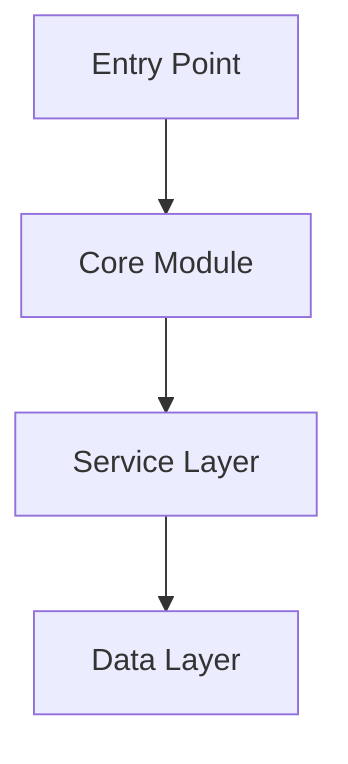
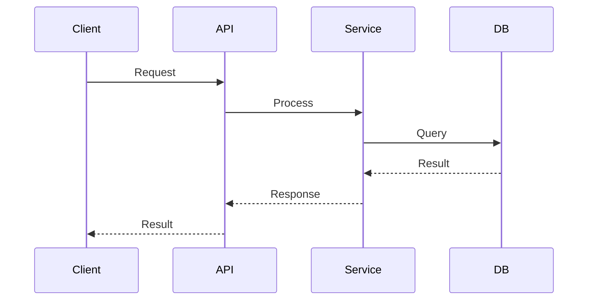
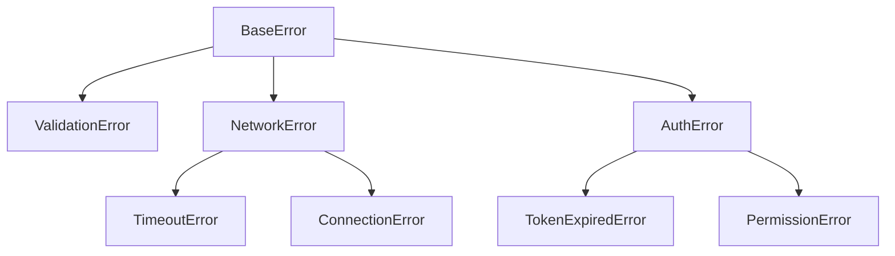

# Documentation Templates

Templates for generating consistent, AI-optimized documentation.

## Table of Contents
1. [Config File](#config-file)
2. [State File](#state-file)
3. [Overview](#overview)
4. [Architecture](#architecture)
5. [Function Documentation](#function-documentation)
6. [Type Documentation](#type-documentation)
7. [Feature Documentation](#feature-documentation)
8. [Error Documentation](#error-documentation)
9. [Index Files](#index-files)
10. [PR Description](#pr-description)

---

## Config File

Path: `documentation/config.json`

```json
{
  "stack": "nodejs",
  "exclude": [
    "src/generated/**",
    "**/*.test.ts",
    "**/*.spec.ts",
    "**/node_modules/**",
    "**/dist/**",
    "**/build/**"
  ],
  "include_inline_examples": true,
  "include_architecture_diagrams": true,
  "docusaurus": null
}
```

With Docusaurus sync enabled:

```json
{
  "stack": "nodejs",
  "exclude": ["..."],
  "include_inline_examples": true,
  "include_architecture_diagrams": true,
  "docusaurus": {
    "repo": "git@github.com:org/docs-site.git",
    "branch": "main",
    "docs_path": "docs/api",
    "sidebar_label": "API Reference"
  }
}
```

Fields:
- `stack`: Detected language/framework
- `exclude`: Glob patterns to skip
- `include_inline_examples`: Generate usage examples
- `include_architecture_diagrams`: Generate mermaid diagrams
- `docusaurus`: Docusaurus sync config (null to disable)
  - `repo`: Git URL of Docusaurus repository
  - `branch`: Branch to push to
  - `docs_path`: Path within Docusaurus repo for docs
  - `sidebar_label`: Label for the sidebar category

---

## State File

Path: `documentation/.docstate`

```json
{
  "last_commit": "a1b2c3d4e5f6789...",
  "last_run": "2025-01-29T15:30:00Z"
}
```

With Docusaurus sync enabled:

```json
{
  "last_commit": "a1b2c3d4e5f6789...",
  "last_run": "2025-01-29T15:30:00Z",
  "docusaurus_last_sync": "2025-01-29T15:35:00Z",
  "docusaurus_synced_files": [
    "public/functions/create-user.md",
    "public/types/user.md"
  ]
}
```

---

## Overview

Path: `documentation/overview.md`

```markdown
# [Project Name]

> [One-line description]

## Purpose

[What problem this project solves, 2-3 sentences]

## Primary Entry Points

| Entry Point | Purpose | Import |
|-------------|---------|--------|
| `functionName` | Brief description | `import { functionName } from 'package'` |

## Quick Start

[Minimal working example, 5-10 lines]

## Dependencies

| Dependency | Purpose | Required |
|------------|---------|----------|
| `dep-name` | What it provides | Yes/No |

## Requirements

- Runtime: [e.g., Node.js >= 18]
- Platform: [Any constraints]
```

---

## Architecture

Path: `documentation/architecture.md`

```markdown
# Architecture

## Component Overview

[Mermaid diagram showing main components]



## Data Flow

[Describe how data moves through the system]



## Design Patterns

| Pattern | Location | Purpose |
|---------|----------|---------|
| Repository | `src/repositories/` | Data access abstraction |
| Factory | `src/factories/` | Object creation |

## Architectural Decisions

### [Decision Title]

**Context**: [Why this decision was needed]

**Decision**: [What was decided]

**Consequences**: [Trade-offs and implications]

## External Dependencies

| Service | Purpose | Configuration |
|---------|---------|---------------|
| PostgreSQL | Primary database | `DATABASE_URL` |
```

---

## Function Documentation

Path: `documentation/public/functions/[module]/[function-name].md`

```markdown
# functionName

> Brief one-line description.

## Signature

```typescript
function functionName(
  param1: string,
  param2: number,
  options?: Options
): Promise<Result>
```

## Description

Detailed explanation of what this function does, when to use it,
and any important context.

## Parameters

| Name | Type | Required | Default | Description |
|------|------|----------|---------|-------------|
| param1 | `string` | Yes | - | Description of param1 |
| param2 | `number` | Yes | - | Description of param2 |
| options | `Options` | No | `{}` | Configuration options |
| options.timeout | `number` | No | `5000` | Timeout in milliseconds |
| options.retries | `number` | No | `3` | Number of retry attempts |

## Returns

**Type**: `Promise<Result>`

Returns a Result object containing:
- `success`: boolean indicating operation status
- `data`: the processed data when successful
- `error`: error details when unsuccessful

## Errors

| Error | Condition | Recovery |
|-------|-----------|----------|
| `ValidationError` | When param1 is empty | Provide non-empty string |
| `TimeoutError` | When operation exceeds timeout | Increase timeout or retry |
| `NetworkError` | When connection fails | Check network, retry later |

## Example

```typescript
import { functionName } from 'package';

const result = await functionName('input', 42, {
  timeout: 10000,
  retries: 5
});

if (result.success) {
  console.log(result.data);
}
```

## Safety Considerations

- **Thread Safety**: Safe for concurrent calls
- **Idempotency**: Multiple calls with same input produce same result
- **Side Effects**: Writes to database
- **Resource Cleanup**: Automatically closes connections

## Related

- [relatedFunction](./relatedFunction.md) - Does related thing
- [ResultType](../../types/ResultType.md) - Return type definition
```

---

## Type Documentation

Path: `documentation/public/types/[type-name].md`

```markdown
# TypeName

> Brief description of what this type represents.

## Definition

```typescript
interface TypeName {
  id: string;
  name: string;
  email: string;
  createdAt: Date;
  metadata?: Record<string, unknown>;
}
```

## Fields

| Field | Type | Required | Description |
|-------|------|----------|-------------|
| id | `string` | Yes | Unique identifier, UUID format |
| name | `string` | Yes | Display name, 1-100 characters |
| email | `string` | Yes | Email address, must be valid format |
| createdAt | `Date` | Yes | When the record was created |
| metadata | `Record<string, unknown>` | No | Arbitrary key-value data |

## Validation Rules

- `id`: Must be valid UUID v4
- `name`: Non-empty, max 100 characters
- `email`: Must match email regex pattern

## Serialization

**JSON**:
```json
{
  "id": "550e8400-e29b-41d4-a716-446655440000",
  "name": "John Doe",
  "email": "john@example.com",
  "createdAt": "2025-01-29T15:30:00Z"
}
```

**Notes**:
- `createdAt` serializes as ISO 8601 string
- `metadata` keys are preserved as-is

## Related Types

- [CreateTypeRequest](./CreateTypeRequest.md) - Input for creating this type
- [UpdateTypeRequest](./UpdateTypeRequest.md) - Input for updating this type

## Used By

- [createTypeName](../functions/module/createTypeName.md)
- [getTypeName](../functions/module/getTypeName.md)
- [updateTypeName](../functions/module/updateTypeName.md)
```

---

## Feature Documentation

Path: `documentation/public/features/[feature-name].md`

```markdown
# Feature Name

> One-line description of the feature.

## Overview

[2-3 paragraph explanation of what this feature does and why it exists]

## Configuration

| Option | Type | Default | Description |
|--------|------|---------|-------------|
| enabled | `boolean` | `true` | Enable/disable feature |
| mode | `string` | `"auto"` | Operating mode |

### Enabling

```typescript
import { configure } from 'package';

configure({
  featureName: {
    enabled: true,
    mode: 'strict'
  }
});
```

## Public API

| Function/Type | Description |
|---------------|-------------|
| [mainFunction](../functions/feature/mainFunction.md) | Primary function |
| [FeatureConfig](../types/FeatureConfig.md) | Configuration type |

## Integration Examples

### Basic Usage

```typescript
import { feature } from 'package';

const result = await feature.process(input);
```

### Advanced Usage

```typescript
import { feature, FeatureConfig } from 'package';

const config: FeatureConfig = {
  // ...
};

const processor = feature.createProcessor(config);
const result = await processor.run(input);
```

## Limitations

- Maximum input size: 10MB
- Rate limit: 100 requests/minute
- Not supported in browser environment

## Edge Cases

| Scenario | Behavior |
|----------|----------|
| Empty input | Returns empty result |
| Invalid format | Throws `ValidationError` |
| Timeout | Retries up to 3 times |
```

---

## Error Documentation

### Error Patterns

Path: `documentation/public/errors/patterns.md`

```markdown
# Error Handling Patterns

## Error Hierarchy



## Base Error Structure

All errors extend `BaseError`:

```typescript
class BaseError extends Error {
  code: string;
  context?: Record<string, unknown>;
}
```

## Error Propagation

Errors propagate up the call stack with context:

```typescript
try {
  await service.process(data);
} catch (error) {
  if (error instanceof ValidationError) {
    // Handle validation
  } else if (error instanceof NetworkError) {
    // Handle network issues
  }
  throw error; // Re-throw unknown errors
}
```

## Recovery Strategies

| Error Type | Strategy |
|------------|----------|
| `ValidationError` | Fix input data |
| `TimeoutError` | Retry with backoff |
| `TokenExpiredError` | Refresh token, retry |
| `RateLimitError` | Wait, then retry |
```

### Error Category

Path: `documentation/public/errors/[error-category].md`

```markdown
# Validation Errors

Errors related to input validation.

## ValidationError

**Thrown when**: Input fails validation rules

**Properties**:
| Property | Type | Description |
|----------|------|-------------|
| field | `string` | Field that failed validation |
| rule | `string` | Rule that was violated |
| value | `unknown` | The invalid value |

**Example**:
```typescript
try {
  validate(input);
} catch (error) {
  if (error instanceof ValidationError) {
    console.log(`Field ${error.field} failed: ${error.rule}`);
  }
}
```

**Recovery**: Correct the input value according to the rule

## SchemaError

**Thrown when**: Data doesn't match expected schema

**Recovery**: Ensure data conforms to documented schema
```

---

## Index Files

Path: `documentation/[section]/_index.md`

```markdown
# [Section] Index

Quick reference for all [section] items.

## Summary

| Item | Description | Added | Status |
|------|-------------|-------|--------|
| [item1](./item1.md) | Brief description | v1.0 | Stable |
| [item2](./item2.md) | Brief description | v1.2 | Stable |
| [item3](./item3.md) | Brief description | v2.0 | Beta |

## By Category

### Authentication
- [login](./auth/login.md)
- [logout](./auth/logout.md)

### Data Processing
- [process](./data/process.md)
- [transform](./data/transform.md)

## Recently Updated

| Item | Change | Date |
|------|--------|------|
| [item1](./item1.md) | Added retry parameter | 2025-01-29 |

## Deprecated

| Item | Replacement | Remove By |
|------|-------------|-----------|
| [oldItem](./oldItem.md) | [newItem](./newItem.md) | v3.0 |
```

---

## PR Description

```markdown
## Documentation Update

**Commit range**: `abc123..def456`

### Summary

- Added: X functions, Y types
- Modified: X functions, Y types
- Removed: X functions (marked deprecated)

### Details

#### Added
- `public/functions/auth/validateToken.md` - New token validation function
- `public/types/TokenClaims.md` - JWT claims type definition

#### Modified
- `public/functions/auth/login.md` - Added optional `remember` parameter
- `public/functions/api/createUser.md` - Now throws `DuplicateEmailError`

#### Removed
- `public/functions/auth/legacyLogin.md` - Marked deprecated, use `login` instead
```
